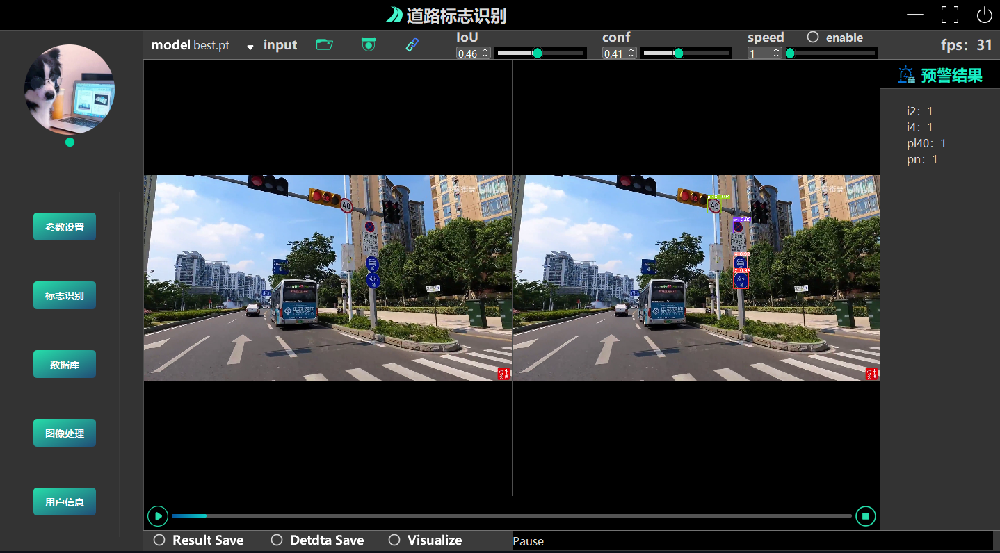
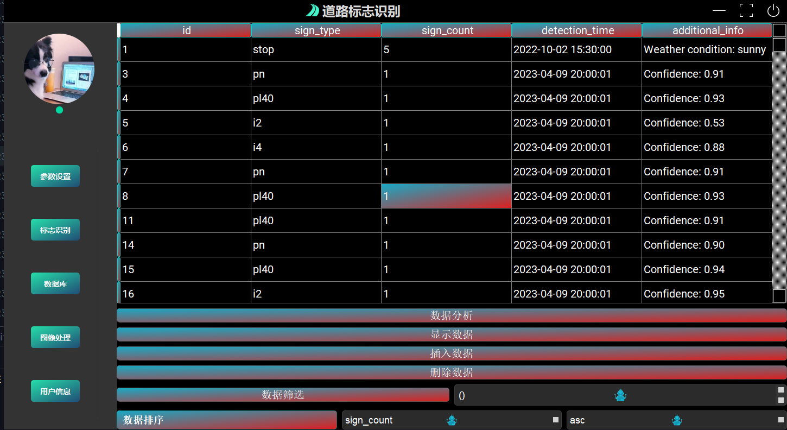
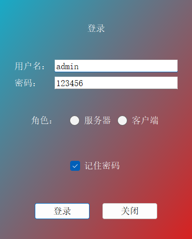

<h1 align="center">Road Sign Recognition Project Based on YOLOv5 (YOLOv5 GUI)</h1>

<p align="center">
  <a href="README.md">English</a> |
  <a href="data/doc/README_cn.md">简体中文</a>
</p>

<p align="center">
  <a href="data/doc/README_Parameter adjustment.md">训练策略</a>
</p>


This is a road sign recognition project based on YOLOv5, developed with a PyQt5 interface, YOLOv5 trained model, and MySQL database. The project consists of five modules: parameter initialization, sign recognition, database, data analysis, and image processing(Please refer to the Chinese document for details),This project uses YOLOv5 v6.1.

 
## Screenshots

* ### Sign Recognition Module
  
* ### Image Processing and Data Augmentation Module
  
* ### Parameter Initialization Module
  
* ### Database Module
  
* ### Data Analysis Module
  
* ### Login Interface
  
  


### Video Demo

[Road Sign Recognition System Based on YOLOV5](https://www.bilibili.com/video/BV1Ck4y1Y7Bk/?spm_id_from=333.999.0.0&vd_source=40d9cda43378fbc89cd5184e09bf1272)

### Install Dependencies

To install the required dependencies, run:

```bash
pip install -r requirements.txt
```
---
## **Quick Start**

### 1. **Setting Up the Database**

To run the application, you need to set up your MySQL database. Follow these steps to prepare your database:

- **Automatic Database Creation (Optional)**:
    - If you prefer an automated setup, a batch script is provided. Run the **`setup_database.bat`** script to create the database. This requires MySQL to be installed and configured on your system.
- **Manual Database Creation**:
    - Alternatively, you can manually create the database in MySQL. Import and execute the **`data/regn_mysql.sql`** file in your MySQL environment to set up the necessary database and tables.

### 2. **Configuring Database Connection in Code**
After setting up the database, update the connection Settings in the code to change the authentication information for your local database (these four variables are at the beginning of the code, around line 59, as follows); P.S. These authentication messages are called twice in the code (around lines 111 and 1783)
```python
# Database connection settings as global variables
DB_HOST = 'localhost'    # Database host
DB_USER = 'root'         # Database user
DB_PASSWORD = '1234'     # Database password
DB_NAME = 'traffic_sign_recognition'  # Database name
```

### **Note on Cryptography Package**

If you encounter a **`RuntimeError: 'cryptography' package is required for sha256_password or caching_sha2_password auth methods`**, This is because the database authentication has gone wrong and the database needs to be properly created and the password entered.

### 3. Run `main.py`.

### 4. Enter your account and password to log in

Here are the default login credentials:

| Username | Password |
|----------|----------|
| admin    | 123456   |
| 1        | 2        |

Or modify the main function in main.py: remove the logon logic to enter the system directly without authentication.

---
## Project Structure

- `pt` folder: Contains the YOLOv5 model file `best.pt` for road sign recognition.
- `main_with` folder: Contains `login.py` for the login UI and `win.py` for the main UI.
- `dialog` folder: Contains the RTSP pop-up interface.
- `apprcc_rc.py`: The resource file for the project.
- `login_ji.py`: Implements the login logic for the UI.
- `data/run/run-exp52`: The YOLOv5 road sign recognition model trained for 300 epochs.
- `utils/tt100k_to_voc-main` folder: Tool for converting JSON annotations to YOLO format.
- `result`: Folder to save inference results.
- `run`: Folder to save training logs and outputs.
- Dataset: Download from [TT100k : Traffic-Sign Detection and Classification in the Wild](https://cg.cs.tsinghua.edu.cn/traffic-sign/).
- Database files: Located in the `data` folder, see `-regn_mysql.sql` for setup.

> Since this project was done while I was learning YOLOv5 (quite a while ago), the main logic is concentrated in the main.py file. In other words, I didn't modularize different functions, and I didn't have a clear division of module structure. Now I want to divide it into modules, but I'm too lazy,  ha ha :smile:. If you're interested, you can modularize it so it's clearer.
## Acknowledgements

- For converting the TT100K dataset to VOC format and selecting more than 100 images and XMLs for each category, see this [CSDN blog post](https://blog.csdn.net/Hankerchen/article/details/120727299?spm=1001.2014.3001.5502).
- The PyQt5-YOLOv5 integration was inspired by this [GitHub repository](https://github.com/Javacr/PyQt5-YOLOv5).

## Star History

Track the GitHub star history of this project:


