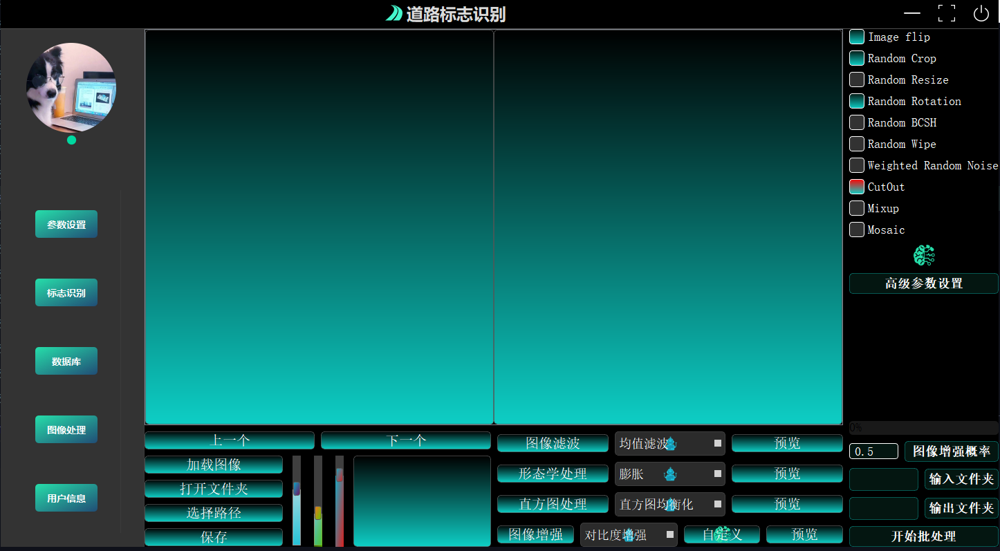
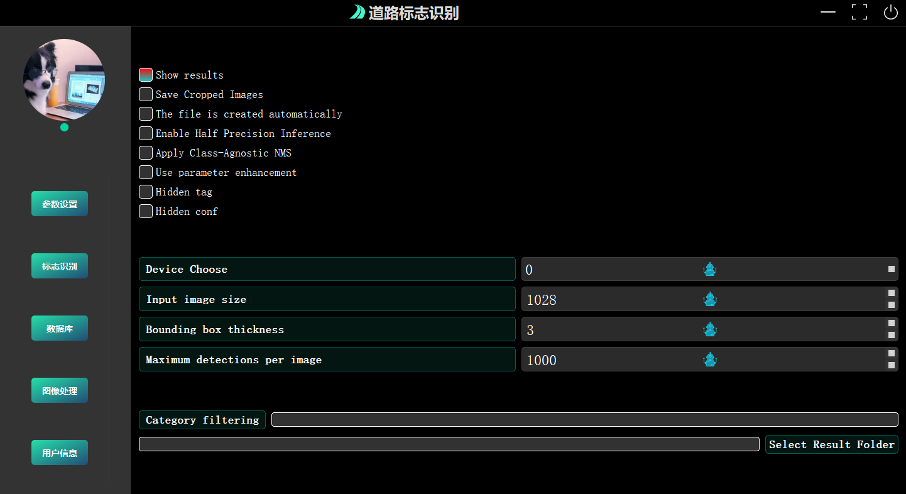
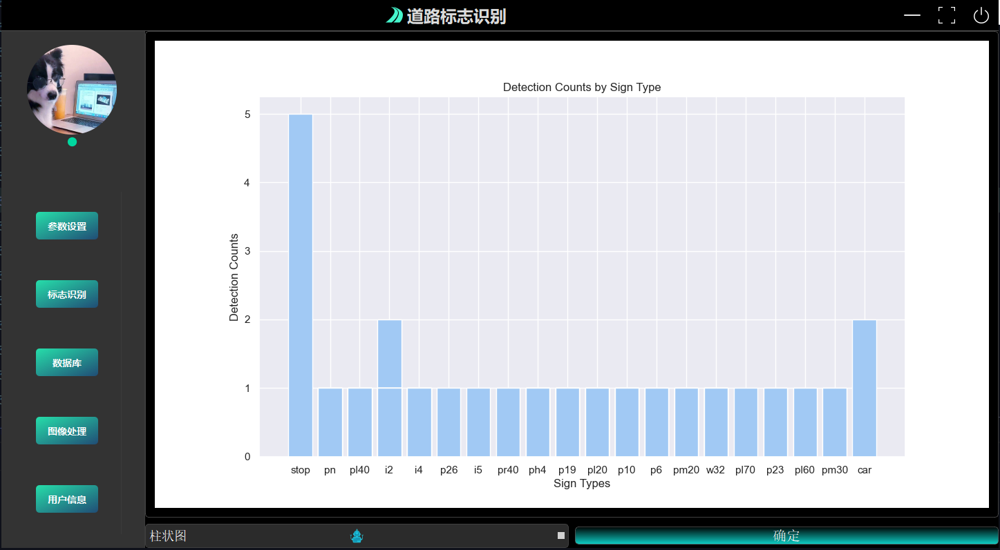

<h1 align="center">基于YOLOv5的道路标志识别项目（yolov5界面GUI）</h1>

  <a href="README.md">English</a> |
  <a href="README_cn.md">简体中文</a>

这是一个关于yolov5的道路标志识别项目，使用Pyqt5开发界面，Yolov5训练模型，数据库Mysql，包含五个模块：初始化参数、标志识别、数据库、数据分析和图像处理。

## 软件截图

* ### 标志识别模块
  
* ### 图像处理与数据增强模块
  
* ### 初始化参数模块
  
* ### 数据库模块
  
* ### 数据分析模块
  
* ### 登录界面
  

### 视频

[基于YOLOV5的道路标志识别系统](https://www.bilibili.com/video/BV1Ck4y1Y7Bk/?spm_id_from=333.999.0.0&vd_source=40d9cda43378fbc89cd5184e09bf1272)

## 开始

运行`main.py`。

### 账户密码

- admin 123456
- 1 2
- 修改main函数可直接进入

## 项目模块

- `pt`文件夹：存放模型
- `main_with`文件夹：`login.py`(登陆ui)、`win.py`(主ui)
- `dialog`文件夹：rtsp弹出界面
- `apprcc_rc.py`：资源文件
- `login_ji.py`：界面登陆逻辑文件
- `run-exp52`：300轮训练后的道路标志识别模型
- `tt100k_to_voc-main`文件夹：json转yolo格式
- 数据集：[TT100k : Traffic-Sign Detection and Classification in the Wild](https://cg.cs.tsinghua.edu.cn/traffic-sign/)

### 安装依赖

pip install -r requirements.txt

## 致谢

- [将TT100K数据集转成VOC格式，并且用Python脚本选出45类超过100张的图片和XML](https://blog.csdn.net/Hankerchen/article/details/120727299?spm=1001.2014.3001.5502)
- https://github.com/Javacr/PyQt5-YOLOv5
